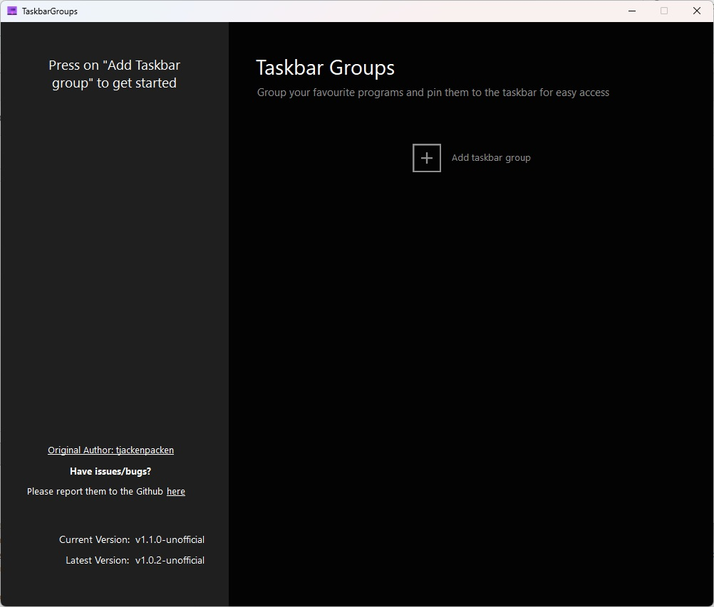
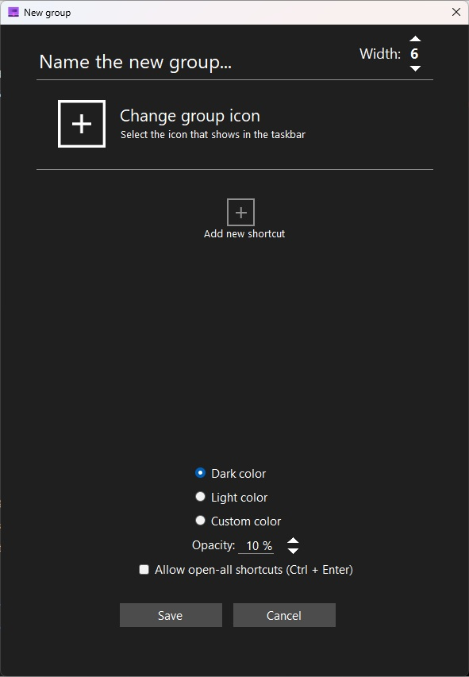

<p align="center">
  
</p>
<h1 align="center">Taskbar Groups</h1>
<p align="center">
<a href="https://github.com/hummbugg/taskbar-groups/issues"></a>
<a href="https://github.com/hummbugg/taskbar-groups/"></a>
<a href="https://github.com/hummbugg/taskbar-groups/releases"></a>
<a href="https://github.com/hummbugg/taskbar-groups/blob/master/LICENSE"></a>
	
</p>
<p align="center">
  <b>Taskbar groups is a lightweight utility for Windows that lets the users create groups of shortcuts in the taskbar.</b>
  
<p align="center">
	<a href="https://github.com/hummbugg/taskbar-groups/releases">Download & Release Notes</a>
</p>
<br />

# Taskbar Groups – Unofficial Maintained Build

This is an unofficial maintained fork of the original Taskbar Groups project by **tjackenpacken**.

Original project:  
https://github.com/tjackenpacken/taskbar-groups

Maintained fork:  
https://github.com/hummbugg/taskbar-groups

---

## 📦 Download Ready-to-Run Build

Download the latest compiled release here:

https://github.com/hummbugg/taskbar-groups/releases

No Visual Studio is required to use the release ZIP.

---

## ⚠️ Windows Security Notice (Important)

Because this application is distributed as a ZIP downloaded from the internet, Windows may block the files.

### Recommended:

1. Right-click the downloaded ZIP file  
2. Click **Properties**  
3. Check **Unblock**  
4. Click **Apply**  
5. Extract the ZIP  
6. Run `TaskbarGroups.exe`

### If already extracted:

```powershell
Get-ChildItem -Path "C:\Path\To\TaskbarGroups" -Recurse -File | Unblock-File
```

[](#demo-video)

## 🎬 Demo Video

<p align="center">
  <a href="https://youtu.be/WtBsh_ITvuQ" target="_blank" rel="noopener noreferrer">
    
  </a>
</p>

<p align="center">
  Click the thumbnail above to watch the Taskbar Groups v1.1.0-unofficial demo video on YouTube.
</p>


 [ ](#creating-your-first-group)
## 🛠️ Creating your first group
    1. Press on the "Add taskbar group"
    2. Give the group a name and an icon
    3. Click on the "Add new shortcut" and select an .exe or .lnk (repeat until you got all your desired shortcuts)
	    a. You can select multiple .exe or .lnk files at once
	    b. You can drag and drop .exe, .lnk, or folders into the add new shortcut field
    4. Save the group
    enter image description here5. Left click on the group
    6. In the folder that opens up, right click on the highlighted shortcut
    7. Select "Pin to taskbar"

 ## Runtime Requirement

Taskbar Groups requires Microsoft .NET Framework 4.7.2 or later.

Most modern Windows systems already include a compatible .NET Framework version.
If the application does not start, install the Microsoft .NET Framework 4.7.2 Runtime:

https://dotnet.microsoft.com/en-us/download/dotnet-framework/thank-you/net472-web-installer
 
 [](#screenwindow-documentation)
## 🖥️ Screen/Window Documentation
 Below will be some documentation for each of the screens with explaining the functionality of each of the components.
#### Main screen [](#main-screen)
Here is the main group configuration screen. You get here by executing the TaskbarGroups.exe file. Here you can add groups and see what groups you have created.

#### Group Creation Screen [](#group-creation)
  
Here is the group creation screen. Here you can start customizing and configuring your group. Here is the quick rundown of the features of this window.

**Name the new group** - You can insert any group name (no special characters) that you would like with a maximum character limit of 49 characters in total.

**Width** - You can set the limit for how many shortcuts will appear on each line. For example I have 12 shortcuts and I have a width of 6. It will display 6 shortcuts per row/line.

**Change Group Icon** - You can click the (+) icon and it will bring up a file dialogue. You can select any type of image files (.png, .jpg, etc.), icon files (.ico), and any sort of executable or shortcut files (.exe, .lnk). On top of this you can drag and drop any of the mentioned file types above to use the icons from those files.

**Add new shortcuts** - You can click the (+) icon and it will bring up a file dialogue like the change group icon section. You can select any type of executable or extension files (.exe, .lnk) to add to your group. You can also add **shortcuts** leading to the windows store apps along with steam games/software. **Do note however that if the shortcuts are moved, the application can no longer launch those applications and you will have to re-edit your group.**

**Allow open-all shortcuts** - When you launch the group to try to launch an app, you have the option to launch all the executables inside the group. To enable this feature, this checkbox has to be checked and the group has to be saved. All shortcuts can be launched through the usage of the Ctrl + Enter keybinds.

**Shortcut Item Selection** - Once you have added shortcuts/applications, you can click on the **sides of the individual entries** of those shortcuts/applications or anywhere that a text or image aren't blocking the background area. Clicking on them will "select" them and they would have a permanent background that is darker than the rest of the entries. This will be the same color as when you hover over applications/shortcuts. This will be needed to set **Working Directories** and **Arguments**.

**Working Directory** - Once you have selected an item, this textbox and the choose folder beside it will be enabled. Here you can change what working directory the application starts with. This may be required for some applications. By default for older groups, the working directory is the directory of the taskbar groups application. For new added shortcuts/applications, the working directory will be set as the location of the application or the directory of the target file for shortcuts. You can also manually set a loation through the **Select Directory** button. Any directory that is changed manually will be checked to be valid and if the working directory is invalid, the target path will be set with the same process as if you added a new application/shortcut.

**Arguments** - Once you have selected an item, this textbox is enabled and you can type any launch arguments that you would like to include with the application on launch.

**Dark color/Light color/Custom color** - Here you can select what color you want the background of your group to be.

**Opacity** - Here you can select how transparent you want the background of your application to be. The scale work from 0% (Solid color, no opacity) to 100% (Fully transparent).

**Entry Name** - Whenever you add an application, the entry will have the text assumed from the name of the application without the extension at the end (.exe, .txt, etc.). This can be changed if you select the text directly and you can type into field. The textbox that you type in expands/shrinks based on the length of the text to make room to select the entry. The character limit here is 27 characters.

#### Extra Notes [](#extra-notes)
With fetching the icons of executables, the application will directly take the icon of the executable. With extensions, it works a little bit different. The application will try to fix the icon location for the extension to see if that exists anywhere on the system and use that if possible. If not, then the application would try to use the icon of the target file of that extension.

On top of this, this works a bit differently for Microsoft App Store extensions. These extensions don't contain any sort of target path nor icon location. Here the application will try to fetch the image from the system folder where these icons are stored using the ID of the application grabbed from the extension.
[
](#image-caching)
## 📦 Image/Icon Caching
Image/icon caching is done through recreating the icon and placing it locally in the icons folder of the group in the config folder. Here it is loaded up locally as to not waste resources to recreate the icon every time. When icons are deleted/not found, the application will display an x. The icon cache can be regenerated by simply saving the group again through the main application.

[
](#program-shortcuts)
## ⌨️ Program Shortcuts
When you open a group once its created through the shortcut provided, there are a list of hotkeys to make the program more easily usable.

**Top row numbers 1,2,3,4,5,6,7,8,9,0** - Opens the shortcuts at those positions respective from 1-10.

**Ctrl + Enter** - Opens all applications/shortcut within the group at once
(Feature must be enabled through the settings when editing/creating the group for this to work)

[
](#folder-structure)

## 📁 Folder Structure Documentation

#### /config
In the config folder, you will have the data regarding each group that you have created. 
#### /config/<Goup_Name>/Icons
This is the icon cache that comes with the folder. All icons of the shortcuts that you added are added into that cache. This cache will be read from when using your group to not have to fetch each individual icon every time.
#### /config/<Goup_Name>/GroupIcon.ico / GroupImage.png
Created image from the group icon you selected. This will be your application icon and read from when you start up the group.
#### /config/<Goup_Name>/ObjectData.xml
Crucial information about the shortcuts and the group itself stored inside of here. It saves your settings for the group and is important in determining what goes into the group when you open it and any other visual settings you may have configured.
#### /JITComp
In here stores the individual profiles for each form. Essentially these profiles are per-compiled code that the application can read from to improve loading times and responsiveness in the system.
#### /Shortcuts
Here is where all of your shortcuts to activate your group will go. All groups created will have their shortcut created here and after creation, you can feel free to move the shortcut or pin it to any desired locations.

## 📜 License
This project is licensed under the [MIT License](https://github.com/tjackenpacken/taskbar-groups/blob/master/LICENSE).


